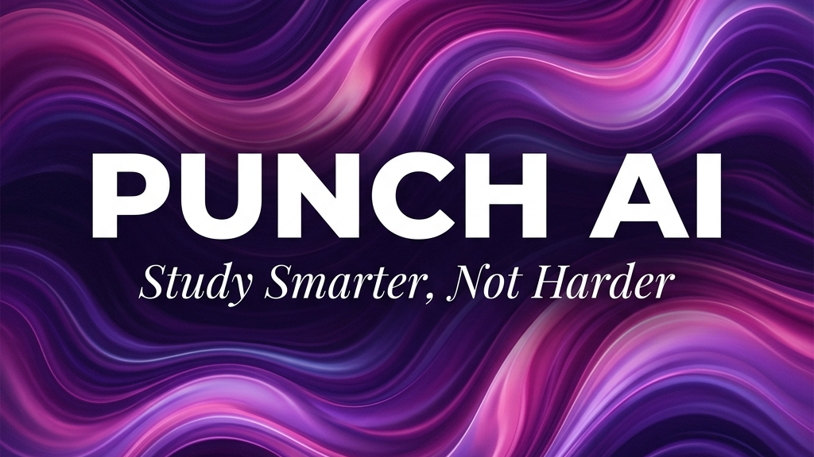

<p align="center">
  
</p>

A high-fidelity, minimalist study workspace that transforms free-form notes or complex topics into interactive 3D flashcards and multiple-choice quizzes. Powered by **Google Gemini Flash 2.0** with a silent auto-fallback to **Groq (Llama 3)**.

---

## ⚡ Quick Start

### 1. Clone & Install Dependencies
```bash
git clone https://github.com/AryanSingh64/PunchAI.git
cd PunchAI
npm install
```

### 2. Configure Local Keys
Create a `.env` file in the root directory:
```env
GEMINI_API_KEY=your_gemini_api_key
GROQ_API_KEY=your_groq_api_key
```

### 3. Start the Next.js Dev Server
```bash
npm run dev
```
Open **[http://localhost:3000](http://localhost:3000)** in your browser.

> [!TIP]
> If you encounter `ENOENT` routes-manifest or prerender errors (common when switching between production builds and dev mode on Windows), run `npm run clean` to wipe the stale cache folder, then run `npm run dev` again.

---

## 🚀 One-Click Hosting on Vercel

Since the project is built in Next.js, you can deploy both the frontend and backend APIs simultaneously to Vercel for free:

1. Push your repository to GitHub.
2. Go to **[Vercel.com](https://vercel.com/)** and import your repository.
3. Vercel will auto-detect Next.js. Expand the **Environment Variables** panel and add:
   - `GEMINI_API_KEY`
   - `GROQ_API_KEY`
4. Click **Deploy** and your live URL is ready in seconds!

---

## 🎨 Design & Aesthetic Pillars

Punch AI is designed around visual restraint, vertical visual rhythm, and ease of use:
- **Wallpaper Background**: Deep dark theme (`#0F0F10`) with an extremely soft, low-saturation radial bottom glow.
- **Micro-Grain Texture**: Cards feature a subtle SVG fractal noise overlay to look tactile and custom-built.
- **Color Palette**: Highly contrasted text surfaces utilizing a single, striking pink accent (`#F0699E`) for primary actions.
- **Onboarding Focus**: Hide sidebars and app headers when inputs are active. 100% of the screen weight is dedicated to the centered prompt input box.

---

## ⚙️ How It Works (The Core Loop)

```
[Raw Notes/Topic] ──> [Next.js API Route] ──> [Gemini Flash 2.0]
                               │                  │ (Fail/Rate Limit)
                               │                  └──> [Groq Fallback]
                               ▼
                    [Zod Schema Guard] ──> [Interactive Study Deck]
```

1. **Input**: Paste lecture slides, textbook notes, or type a simple topic.
2. **Generation**: Client sends prompt to local API handler `/api/generate`. Gemini Flash 2.0 generates structured card and quiz JSON.
3. **Fail-Safe Fallback**: If Gemini fails or hits rate limits, the serverless handler silently calls Groq (Llama-3.3-70b) to fetch the deck.
4. **Zod Validation**: Server outputs are verified against Zod schemas on the client. Malformed AI responses are intercepted before the UI renders.
5. **Session Dashboard**: Deck renders instantly. Switch between 3D Flashcards, interactive Quizzes, and retest incorrect answers.

---

## 🛡️ Fail-Safe Matrix

| Scenario | UI/UX Behavior | Serverless Strategy |
| :--- | :--- | :--- |
| **Gemini API Failure** | Completely silent to the user | API handler immediately falls back to Groq SDK |
| **Both APIs Fail** | Renders custom error card with retry button | API returns `502 Bad Gateway` status |
| **Malformed AI JSON** | Catches parsing exception, shows preview + retry option | Returns `422 Unprocessable` status |
| **Network Timeout (>15s)** | Request is aborted safely via `AbortController` | Request closes safely |
| **Rapid Double Submits** | Aborts stale request in-flight to prevent race states | Safe client-side tracking |
| **Stale Page Reloads** | Previous session is saved and reloadable from History | Local history loads from `localStorage` |

---

## 🛠️ Stack & Technologies

| Layer | Technologies | Key Role |
| :--- | :--- | :--- |
| **Fullstack Framework** | Next.js 15 (App Router) | Unified React frontend + Serverless API handling |
| **State Engine** | `useReducer` + `useContext` | Clean session/retest status management |
| **Icons** | Phosphor Icons (Duotone) | Curated, premium graphic accents |
| **Primary AI** | Google Gemini 2.0 Flash | Ultra-fast semantic data extraction |
| **Fallback AI** | Groq Llama 3.3 70b | High-availability fallback model |
| **Validation** | Zod | Safe response schema parsing |
| **Styles** | Vanilla CSS | Custom design tokens and responsive layouts |
